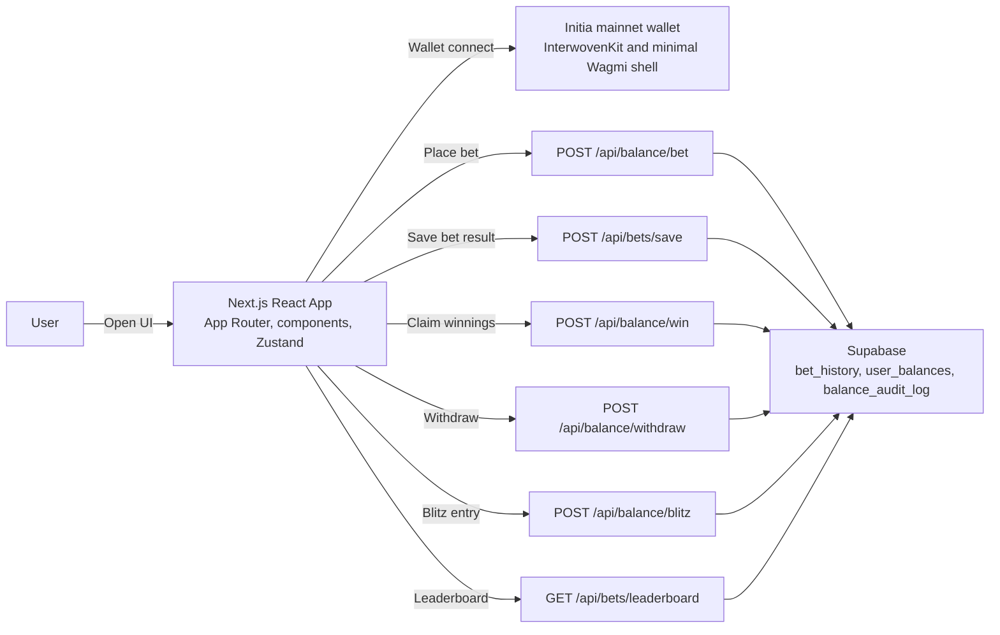
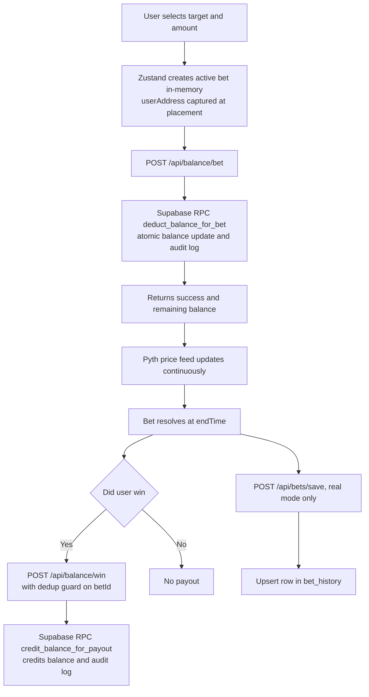
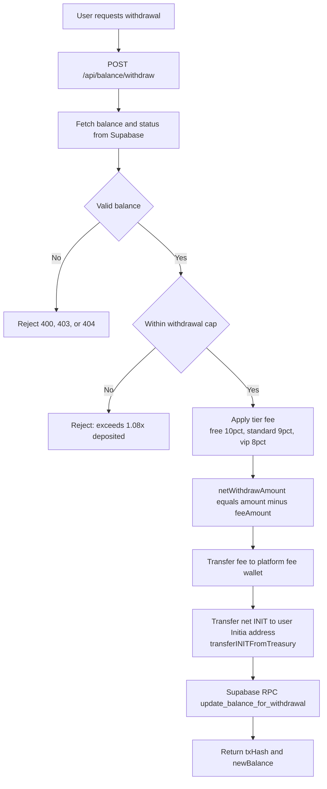
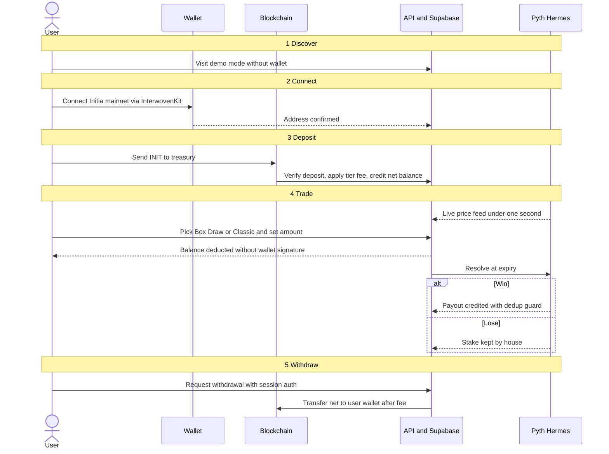

# Initnomo

> **The first binary options trading dapp on-chain.**  
> Fast binary rounds · Pyth oracle pricing · **Initia mainnet** (`interwoven-1`) · Transparent settlement

| | |
|---|---|
| **Chain** | **Initia mainnet** — chain ID `interwoven-1` |
| **Live** | https://initnomo.vercel.app |
| **Repository** | https://github.com/0xamaan-dev/Initnomo |
| **Pitch deck** | https://docs.google.com/presentation/d/1cZuB4i57buCZ2ZyNFNVLxY-qlLUSyTV33J7doVjnMi8/edit?usp=sharing |
| **Demo video** | https://youtu.be/ |

---

## Initia INITIATE submission

- **Project Name**: Initnomo

### Project Overview

Initnomo is an **Initia mainnet** trading experience: fast binary-style rounds driven by **Pyth Hermes**, with **INIT** moving on-chain for deposits, withdrawals, and Blitz entry while house balance and settlement run through **Supabase** for instant UX. It targets traders who want transparent, oracle-bound outcomes instead of opaque Web2 binaries.

### Implementation Detail

- **The custom implementation:** Classic, Box, and Draw modes on a live chart; tiered deposit/withdraw fees; Blitz windows with server-side fee collection (`POST /api/balance/blitz`); referral and leaderboard flows; balance session hardening for API routes.
- **The native feature — Auto-signing:** InterwovenKit Auto-Sign is **configured** on `interwoven-1` for **bank sends** so users can opt in to fewer prompts for repeat **INIT** deposits; see `app/providers.tsx`, `lib/initia/client.ts`, and the **Initia Auto-Sign** panel in `components/balance/DepositModal.tsx`.

### How to run locally

1. Clone the repo and `cd` into the project root.
2. `cp .env.example .env` and fill **Supabase**, **balance secrets**, and **Initia mainnet** variables (`NEXT_PUBLIC_INITIA_*`, `INITIA_TREASURY_PRIVATE_KEY` only on secure machines).
3. `yarn install` then `yarn dev` and open `http://localhost:3000`.
4. Connect with **InterwovenKit**, optionally **enable Auto-Sign** in the deposit modal, deposit **INIT**, then open **`/trade`** to use the product end-to-end.

### Demo video

**1–3 minute walkthrough (YouTube):** https://youtu.be/

---

## Table of Contents

0. [Initia Hackathon INITIATE submission](#initia-hackathon-initiate-submission)
1. [Overview](#overview)
2. [Story & Inspiration](#story--inspiration)
3. [The Problem](#the-problem)
4. [The Solution](#the-solution)
5. [Detailed game mechanics](#detailed-game-mechanics)
6. [Initia network & wallets](#initia-network--wallets)
7. [Platform Features](#platform-features)
8. [Fee Structure](#fee-structure)
9. [Tech Stack](#tech-stack)
10. [Architecture](#architecture)
11. [Supabase Schema](#supabase-schema)
12. [API Reference](#api-reference)
13. [Admin Dashboard](#admin-dashboard)
14. [Directory Structure](#directory-structure)
15. [Environment Variables](#environment-variables)
16. [Local Development](#local-development)
17. [Deployment](#deployment)
18. [Monetization](#monetization)
19. [Market Opportunity](#market-opportunity)
20. [Competitive Landscape](#competitive-landscape)
21. [Roadmap](#roadmap)
22. [Security](#security)

---

## Overview

Initnomo delivers fast binary options trading with millisecond-resolution price feeds powered by **Pyth Hermes**. Users deposit **INIT** on **Initia mainnet** into the **Initnomo treasury**, receive a **house balance** in Supabase, and trade binary rounds without signing every bet. Settlement is deterministic and oracle-driven — no opaque algorithms, no trial-mode bias.

The trading UI consumes **Pyth Hermes** across **many assets** (crypto, forex, stocks, metals, commodities). **On-chain cash flow is INIT-only on Initia mainnet** (chain ID **`interwoven-1`**): deposits, withdrawals, and Blitz fees.

---

## Story & Inspiration

In 2021, I saw an advertisement of a forex binary options app called Binomo. It was a mobile app promoted by big influencers. I tried the free (paper) mode and made 10× in a week. Then I put in three months of my savings in real mode — and lost it all.

Later I found Reddit threads showing that Binomo ran on algorithms that let users win in trial mode and lose in real mode. This happened to millions of traders worldwide.

That day I decided to build a transparent, oracle-driven binary options platform. But in 2021, sub-1-second price feeds didn't exist in Web3. I waited 5 years, and in 2026 the tools were finally ready. **Initnomo** is the result.

---

## The Problem

Today, Binary options trading in Web3 doesn't exist at all.
- Web2 platforms (Binomo, IQ Option) are opaque, algorithmically biased, and fraudulent.
- There were no real-time data oracles that could deliver price feeds in under 1 second — until Pyth Hermes.
- We have 590 million crypto users and 400 million transactions happens every single day on top 200 blockchains.
- One big news/ One big move → oracle crash → no fast-settlement dapp can function.

---

## The Solution

Initnomo solves all of this:

- **Pyth Hermes** delivers sub-1-second price feeds across 1010+ assets.
- **Binary rounds** at 5s / 10s / 15s / 30s / 1m timeframes — no wallet signature per bet.
- **One single EOA treasury** per chain — infinite bets, no cap, instant house balance settlement.
- **Fully on-chain verifiable** — every deposit, withdrawal, and payout is logged immutably.
- **Initia mainnet** (`interwoven-1`) as the settlement chain for treasury + balance mutations in this fork (InterwovenKit).

---

## Detailed Game Mechanics

### 3-Step User Journey

```
Step 1 — Fund
  Connect your Initia **mainnet** wallet (InterwovenKit)
  → Send INIT on **Initia mainnet** to the Initnomo treasury (on-chain deposit)
  → House balance credited instantly (off-chain, Supabase)

Step 2 — Configure
  Pick a game mode: Box / Draw / Classic
  Set your bet amount (from house balance)
  Set expiry time (5s / 10s / 15s / 30s / 1m)

Step 3 — Bet & Settle
  Bet placed — balance deducted instantly, no wallet signature needed
  Pyth Hermes price feed resolves the outcome at expiry
  Win → payout credited to house balance
  Lose → bet amount stays with the house
```

> **P&L is updated via off-chain state (Supabase) for instant UX. Settlement logic is deterministic and oracle-driven — all deposits, withdrawals, and payouts are verified and logged on-chain or in an immutable audit trail.**

---

### Box Mode

**How to play:** The live chart displays a grid of pre-drawn tiles. Each tile represents a **price band** at a specific multiplier. Select a tile and place your bet.

**Win condition:**  
The **tip of the live price line must touch the left edge (start) of the selected tile** while within its price band.

```
Each tile defines:
  priceBottom  (lower bound)
  priceTop     (upper bound)
  startTime    (left edge of the tile — the trigger moment)
  multiplier   (payout if win)

WIN if priceBottom ≤ price(startTime) ≤ priceTop
     i.e. the price line tip is inside the band when it reaches the tile's start
```

**Key mechanic:** The live price line moves forward in real time. The moment its tip crosses the left edge of the tile, the price must be within the tile's price band — that single moment is the entire win/loss determination.

**Risk/reward:** Tighter price band = higher multiplier. Wider band = safer but lower payout. Lower the probability of the price line touching the extreme corner boxes the higher the multipler.

---

### Draw Mode

**How to play:** Draw a rectangle directly on the live price chart. The rectangle defines your own custom price band and time window. A dynamic multiplier is calculated and displayed immediately.

**Win condition:**  
The **price line must pass end-to-end through the drawn square** — meaning the price must remain continuously within the drawn band for the full duration of the rectangle, from its left edge (start time) to its right edge (end time).

```
Drawn rectangle defines:
  priceBottom  (bottom edge of rectangle)
  priceTop     (top edge of rectangle)
  startTime    (left edge — must be in the future)
  endTime      (right edge)

WIN if price stays within [priceBottom, priceTop]
     from startTime through endTime (price traverses the full box)
```

**Dynamic multiplier formula:**  
```
Higher multiplier when:
  ✦ Smaller box (tighter price band)
  ✦ Box is further away from current price
  ✦ Shorter duration
  ✦ Less probable outcome = higher reward
```

**Constraints:**
- Rectangle must start to the right of the current price tip (can only draw into the future)
- Minimum box size enforced to prevent impossibly small targets
- Maximum look-ahead time enforced

---

### Classic Mode

**How to play:** Select UP or DOWN, choose a multiplier tile, set expiry time, place bet.

**Win condition:**  
The Pyth price at `endTime` must be **higher** than the strike price (price at bet placement) for an **UP** bet, or **lower** for a **DOWN** bet.

```
Strike price = Pyth feed price at the moment the bet is placed

  UP bet   → WIN if price(endTime) > strikePrice
  DOWN bet → WIN if price(endTime) < strikePrice
```

**Multipliers:** Grid of fixed targets (1.9×, 2.0×, 2.5×, etc.)  
**Timeframes:** 5s · 10s · 15s · 30s · 1m  
**Risk profile:** Binary — simple directional prediction

---

### Blitz Mode

**How to play:** Pay a **one-time entry fee** for the active Blitz window. In this repository the fee is debited from **INIT house balance** server-side (`POST /api/balance/blitz`) and routed via `collectPlatformFeeFromTreasury` to **`NEXT_PUBLIC_PLATFORM_FEE_WALLET_INIT`** when configured. During the active Blitz window, multipliers are boosted by **2×** (see game store / `GameBoard`).

**Schedule:**
```
[──── BLITZ ACTIVE (1 min) ────][──── COOLDOWN (2 min) ────][── BLITZ ACTIVE ──] ...
```

**Entry fee (Initia / this repo):**

| Network | Fee |
|---------|-----|
| **Initia (INIT)** | **0.01 INIT** per window entry (default in `components/game/GameBoard.tsx`) |

> Historical multi-chain fee tables from the legacy product are intentionally omitted here; this build is **INIT-only**.

**Effect:** `blitzMultiplier = 2.0×` applied on top of the base multiplier for all modes.

---

### Demo Mode

Full simulation of all game modes with no real funds at risk.

- Demo bets use a separate local balance (not Supabase)
- Bet IDs prefixed with `demo-*` — excluded from `bet_history`
- Fully playable without a wallet connection
- Stats tracked separately in admin analytics (real vs demo split)

---

### Settlement Architecture

```
┌─────────────────────────────────────────────────────────────┐
│  OFF-CHAIN (Supabase)                                       │
│  ┌────────────────────┐    ┌──────────────────────────────┐ │
│  │  user_balances     │    │  balance_audit_log           │ │
│  │  INIT house balance │◄───│  every debit / credit event  │ │
│  └────────────────────┘    └──────────────────────────────┘ │
│  ┌────────────────────┐    ┌──────────────────────────────┐ │
│  │  bet_history       │    │  user_sessions               │ │
│  │  all settled bets  │    │  dwell time / pings          │ │
│  └────────────────────┘    └──────────────────────────────┘ │
└─────────────────────────────────────────────────────────────┘
         ▲                            ▲
         │ balance updates (RPC)      │ session pings
         │                            │
┌────────┴────────────────────────────┴────────────────────────┐
│  CLIENT (Next.js + Zustand)                                  │
│  Price feed: Pyth Hermes (<1s updates)                       │
│  Bet state: in-memory activeBets / settledBets               │
│  Resolution: deterministic at endTime                        │
└──────────────────────────────────────────────────────────────┘
         ▲
         │ deposits / withdrawals (on-chain txns)
┌────────┴─────────────────────────────────────────────────────┐
│  ON-CHAIN (Initia mainnet, interwoven-1)                      │
│  Treasury holds deposited INIT                               │
│  Deposits / withdrawals are verifiable mainnet transactions    │
│  Platform + Blitz fees → `NEXT_PUBLIC_PLATFORM_FEE_WALLET_INIT` │
└──────────────────────────────────────────────────────────────┘
```

**Key properties:**
- **No wallet signature per bet** — bets are instant off-chain balance operations
- **Oracle-driven** — Pyth Hermes price at `endTime` is the single source of truth
- **Deduplication** — server checks `bet_id` in `balance_audit_log` before every payout (no double credits)
- **Immutable audit trail** — every balance event logged with `operation_type`, `amount`, and `transaction_hash`
- **Race condition protection** — bet removed from `activeBets` synchronously before any async settlement call

---

## Initia network & wallets

> **Repository scope:** this **Initnomo** build targets **Initia mainnet only** (chain ID **`interwoven-1`**, native **INIT**). Treasury, deposits, withdrawals, and Blitz settlement all assume **mainnet** RPC/REST endpoints — not Initia testnets. The architecture diagrams below describe the same product loop; swap the wallet/rail labels mentally where the historical text still says “multi-chain”.

| Network | Asset | Wallets | Notes |
|---------|-------|---------|-------|
| **Initia mainnet** (`interwoven-1`) | **INIT** | InterwovenKit (`InterwovenKitProvider`) | Default public RPC/REST in `.env.example` point at mainnet |

A minimal **Wagmi** provider exists to satisfy dependencies that call `useConfig`; it is **not** a second trading chain in this build.

---

## Platform Features

### Deposits
- User sends **INIT** on **Initia mainnet** to the treasury (`NEXT_PUBLIC_INITIA_TREASURY_ADDRESS`); ensure `NEXT_PUBLIC_INITIA_CHAIN_ID=interwoven-1` in production
- Server verifies the transaction with Initia mainnet REST/RPC (`verifyInitiaDepositTx`, `lib/initia/`)
- Platform fee deducted; **net** amount credited to `user_balances` via `update_balance_for_deposit`
- Fee logged as `platform_fee` in `balance_audit_log`

### Withdrawals
- User requests withdrawal amount ≤ available **INIT** house balance
- Server uses `transferINITFromTreasury` to send **net INIT** to the user’s Initia address (see `app/api/balance/withdraw/route.ts`)
- **Withdrawal cap / review thresholds** may still apply depending on your Supabase policies and ops playbooks
- Platform fee collected via `collectPlatformFeeFromTreasury`; treasury sends **net** on-chain; Supabase balance updated

### Balance System
- Every wallet has one row per currency in `user_balances`
- All bet deductions and win credits happen atomically via Supabase RPCs
- Full audit trail in `balance_audit_log` with `operation_type`: `deposit`, `withdrawal`, `bet_placed`, `bet_won`, `platform_fee`, `admin_balance_wipe`

### Player Tiers
| Tier | Deposit/Withdrawal Fee |
|------|----------------------|
| `free` | 10% |
| `standard` | 9% |
| `vip` | 8% |

### Referrals
- Every user gets a referral code
- Referrer earns credit when referee deposits; tracked in `user_referrals`
- Admin dashboard shows referral leaderboard

### Access Codes
- Invite-only onboarding via access codes stored in `access_codes` table
- Admin can generate batches and export CSV

### Waitlist
- Email capture at `/waitlist`
- Admin dashboard shows full list

### Public Live Stats
- `GET /api/stats/public` serves aggregate stats (total bets, volume, payouts, win rate, unique wallets)
- Displayed on the landing page in `LiveStatsSection` with animated counters

### Session Tracking
- `POST /api/session/ping` keeps dwell-time alive
- `DELETE /api/session/ping` ends session
- Stored in `user_sessions` for admin Wallet Intel

### Leaderboard
- `GET /api/bets/leaderboard` — aggregated per-wallet profit + win rate
- 60s in-memory cache; 503 fallback to cached snapshot on timeout

### Deduplication & Race Condition Prevention
- `bet_id` checked against `balance_audit_log` before each payout — duplicate credits blocked server-side
- Client-side: `resolveBet` in Zustand removes the bet from `activeBets` synchronously before any async API call
- `userAddress` captured at bet placement time so settlement works even if wallet disconnects mid-round

---

## Fee Structure

### Platform Fees (Deposit & Withdrawal)

Applied as a percentage of the gross amount. Fee is transferred from the treasury to the platform fee collector (`NEXT_PUBLIC_PLATFORM_FEE_WALLET_INIT` for INIT flows in this repo).

| Tier | Fee |
|------|-----|
| free | 10% |
| standard | 9% |
| vip | 8% |

The net amount (after fee) is what's credited or sent on withdrawal.

### Blitz entry fee (Initia / INIT)

In this build, Blitz entry is charged against **house balance** via **`POST /api/balance/blitz`**, which calls **`collectPlatformFeeFromTreasury('INIT', amount)`** so fees land in **`NEXT_PUBLIC_PLATFORM_FEE_WALLET_INIT`** when configured.

| Network | Fee |
|---------|-----|
| **Initia** | **0.01 INIT** per window entry (UI default in `components/game/GameBoard.tsx`) |

---

## Tech stack

### Infra / Tech

Versions follow `package.json` at repo root. The **Initnomo product path** is **Initia mainnet + InterwovenKit + Next.js + Supabase**; additional chain SDKs may still be listed in dependencies from the upstream fork but are **not** part of the shipped Initia-only UX.

| 🖥️ Frontend | 🔗 Web3 / Wallet | ⚙️ Backend | 🛠️ Tooling |
|:------------|:-----------------|:------------|:-----------|
| **Next.js 16.1.3** — App Router, Turbopack | **InterwovenKit** (`@initia/interwovenkit-react` ^2.5) — Initia mainnet `interwoven-1`, deposits via `requestTxBlock`, optional **Auto-Sign** for `MsgSend` | **Next.js Route Handlers** on Vercel (`app/api/*`) | **ESLint 9** + **eslint-config-next** 16.1.3 |
| **React 19.2.3** + **TypeScript** ^5 | **wagmi 3** + **viem 2** — minimal `WagmiProvider` for InterwovenKit peer deps (not a second trading chain) | **Supabase** — Postgres + RPCs (`supabase/migrations/`) | **Jest 30** + **Testing Library** + **fast-check** |
| **Tailwind CSS** v4 | **@cosmjs/*** (amino, stargate, proto-signing, tendermint-rpc) — Initia REST/RPC + tx plumbing in `lib/initia/` | **Pyth Hermes** (`@pythnetwork/hermes-client` 2.0.0) — sub-second price feeds | **Vercel Analytics** + **Speed Insights** |
| **Zustand** ^5 — store slices under `lib/store/` | **Privy** (`@privy-io/react-auth`) — optional; env-gated, not the primary Initia connect path | **Initia treasury** — server-side signing via `INITIA_TREASURY_PRIVATE_KEY` + `lib/initia/backend-client.ts` | **Supabase CLI** (dev) + **ts-node** |
| **TanStack React Query** ^5 | | **PostHog** (`posthog-js` / `posthog-node`) — product analytics | **TypeScript** compiler + **Node 20**-friendly dependency pins (see `package.json` `_resolutions_note`) |

---

## Architecture

### State Management (Zustand — `lib/store/`)

| Slice | Responsibility |
|-------|---------------|
| `walletSlice` | Address, network, account type (real/demo), currency, connect/disconnect |
| `gameSlice` | Game mode, active/settled bets, Pyth price feed, Blitz state, bet placement/resolution |
| `balanceSlice` | House balance, deposit/withdraw, demo balance |
| `historySlice` | Local bet history persistence |
| `referralSlice` | Referral code sync |
| `profileSlice` | Username / profile fetch |

All slices are combined into `useOverflowStore` in `lib/store/index.ts`.

### Mermaid Diagrams

#### High-level architecture



#### Bet lifecycle



#### Withdrawal flow



---

## Supabase Schema

### Tables

| Table | Purpose |
|-------|---------|
| `user_balances` | PK `(user_address, currency)` — balance, tier, status |
| `balance_audit_log` | Every balance event: deposit, withdrawal, bet_placed, bet_won, platform_fee, admin_balance_wipe |
| `bet_history` | Settled bets: asset, direction, amount, payout, won, mode, network |
| `user_profiles` | Username, access_code |
| `user_referrals` | referral_code, referred_by, referral_count |
| `access_codes` | Invite codes + usage |
| `waitlist` | Email capture |
| `user_sessions` | Dwell time / ping tracking |
| `withdrawal_requests` | Manual approval queue |

### RPC Functions

| Function | Purpose |
|----------|---------|
| `update_balance_for_deposit` | Atomic deposit credit + audit log |
| `deduct_balance_for_bet` | Atomic bet deduction + audit log |
| `credit_balance_for_payout` | Atomic win credit + audit log |
| `update_balance_for_withdrawal` | Atomic withdrawal deduction + audit log |
| `increment_referral_count` | Atomic referral counter |

RLS is enforced via migration `004_enable_rls.sql`. All writes from the app use the **service role key** server-side — the anon key is read-only for the client.

Migrations live in `supabase/migrations/`.

---

## API Reference

### Balance

| Method | Route | Purpose |
|--------|-------|---------|
| `GET` | `/api/balance/[address]` | Fetch all balances for a wallet |
| `POST` | `/api/balance/session` | Mint signed HttpOnly cookie for browser balance mutations |
| `POST` | `/api/balance/deposit` | Record INIT deposit, deduct fee, credit net to house balance |
| `POST` | `/api/balance/withdraw` | Execute INIT withdrawal; fee + net transfer from treasury |
| `POST` | `/api/balance/blitz` | Blitz entry fee from house balance; platform fee routing |
| `POST` | `/api/balance/bet` | Deduct bet amount from house balance |
| `POST` | `/api/balance/win` | Credit win payout (with dedup guard) |
| `POST` | `/api/balance/payout` | Alternate payout path |

### Bets

| Method | Route | Purpose |
|--------|-------|---------|
| `POST` | `/api/bets/save` | Upsert resolved bet into `bet_history` |
| `GET` | `/api/bets/history` | User's bet history |
| `GET` | `/api/bets/leaderboard` | Aggregated leaderboard (60s cached) |

### User

| Method | Route | Purpose |
|--------|-------|---------|
| `GET/POST` | `/api/referral` | Fetch/register referral |
| `POST` | `/api/validate-access-code` | Validate invite code |
| `POST/DELETE` | `/api/session/ping` | Session tracking start/end |
| `GET` | `/api/withdrawals` | User's withdrawal request history |
| `GET` | `/api/initia/balance` | Initia chain balance helper |

### Public Stats

| Method | Route | Purpose |
|--------|-------|---------|
| `GET` | `/api/stats/public` | Aggregate platform stats (revalidate 300s) |

### Admin

> The routes below reflect the **original multi-chain product** admin surface. This Initnomo fork may not expose every handler; confirm under `app/api/` in your checkout.

| Method | Route | Purpose |
|--------|-------|---------|
| `POST` | `/api/admin/auth` | Admin login |
| `POST` | `/api/admin/logout` | Admin logout |
| `GET` | `/api/admin/stats` | Dashboard stats (real/demo split) |
| `GET` | `/api/admin/mode-analytics` | Per-game-mode P&L |
| `GET` | `/api/admin/player-ledger` | Per-wallet financial summary |
| `GET` | `/api/admin/users` | User list for ledger |
| `GET` | `/api/admin/transactions` | Deposit/withdrawal audit stream |
| `GET` | `/api/admin/game-history` | Raw bet history rows |
| `GET` | `/api/admin/treasury-balances` | On-chain treasury balances + USD estimates |
| `GET` | `/api/admin/wallet-insights` | Deep wallet analytics |
| `GET` | `/api/admin/currencies` | Market/asset config |
| `GET` | `/api/admin/waitlist` | Waitlist email list |
| `GET/POST` | `/api/admin/access-codes` | List/generate invite codes |
| `GET` | `/api/admin/withdrawal-requests/pending` | Manual withdrawal queue |
| `POST` | `/api/admin/withdrawal-requests/[id]/accept` | Approve + execute withdrawal |
| `POST` | `/api/admin/withdrawal-requests/[id]/reject` | Reject withdrawal request |
| `GET` | `/api/admin/danger-zone` | Sensitive admin ops |

---

## Admin dashboard

> **Note:** the full `/dashboard` UI and `/api/admin/*` route matrix from the legacy README may not ship in this fork. Server-side admin helpers still live under `lib/admin/` for stats and auth patterns.

Located at `/dashboard` when enabled. Protected by admin auth (`requireAdminAuth`).

| Tab | What it shows |
|-----|--------------|
| **Wallet Intel** | Look up any address — balances, audit log, bet history, withdrawals, session dwell time, explorer links |
| **Ledger** | All users: identity, currency, liquidity |
| **Player P&L** | Per-wallet: deposited / withdrawn / available balance / net P&L / bets / fees paid / sortable|
| **Gameplay** | Game Mode P&L panel (Classic/Box/Draw — win rate, house P&L, by-chain breakdown, top assets) + full bet history with Real/Demo/Chain filters |
| **Financials** | Deposit/withdrawal stream; pending withdrawal queue with Accept/Reject |
| **Inventory** | Pyth-fed market asset list |
| **Referrals** | Referral leaderboard and stats |
| **Waitlist** | Email capture list |
| **Access Codes** | Generate batch, view usage, export CSV |
| **Danger Zone** | High-risk admin operations |

## Directory Structure

```
Initnomo-main/
├── app/                        # Next.js App Router
│   ├── page.tsx                # Landing page
│   ├── trade/                  # Main game UI
│   ├── dashboard/              # Admin dashboard
│   ├── leaderboard/            # Public leaderboard
│   ├── profile/                # User profile
│   ├── referrals/              # Legacy referral page (see also `/rewards`)
│   ├── waitlist/               # Waitlist signup
│   ├── withdrawals/            # Withdrawal history
│   ├── api/                    # All API route handlers
│   └── providers.tsx           # Wallet + query providers
│
├── components/
│   ├── game/                   # GameBoard, LiveChart, TierStatusModal
│   ├── wallet/                 # WalletConnectModal, WalletDiscoveryModal
│   ├── balance/                # DepositModal, WithdrawModal
│   ├── landing/                # LiveStatsSection, DemoVideoSection, AdvisorsRevealSection, etc.
│   └── ui/                     # Shared UI primitives
│
├── lib/
│   ├── store/                  # Zustand slices (wallet, game, balance, history, referral, profile)
│   ├── fees/                   # platformFee.ts — tier fees + treasury fee transfers
│   ├── admin/                  # Stats helpers, auth helpers, wallet variants
│   ├── supabase/               # service + browser clients
│   ├── initia/                 # Initia RPC/REST client + treasury signing
│   ├── balance/                # Session cookie, API guard, reconciliation helpers
│   ├── referral/               # Share / landing URL helpers
│   ├── posthog/                # Analytics wiring
│   ├── utils/                  # price feed helpers, formatting, errors
│   └── logging/                # error-logger
│
├── hooks/                      # useSessionTracker, etc.
├── types/                      # Shared TypeScript types
├── public/                     # Static assets (logos, images)
├── supabase/                   # migrations/, scripts/, tests
├── contracts/                  # Solidity / Hardhat project
├── scripts/                    # Ops scripts (balance sync, reconcile)
└── docs/                       # ENVIRONMENT.md, CONTRIBUTING.md, SECURITY_REPORTING.md
```

---

## Environment variables

Copy `.env.example` → `.env` and fill values. **The Initnomo template is intentionally Initia-only** (see repo root `.env.example`).

```env
NEXT_PUBLIC_APP_NAME=Initnomo
NEXT_PUBLIC_APP_URL=https://initnomo.vercel.app

# Supabase
NEXT_PUBLIC_SUPABASE_URL=
NEXT_PUBLIC_SUPABASE_ANON_KEY=
SUPABASE_SERVICE_KEY=

# Balance API auth
BALANCE_INTERNAL_SECRET=
NEXT_PUBLIC_BALANCE_API_KEY=
BALANCE_SETTLEMENT_SECRET=

# Initia mainnet (interwoven-1) — app is configured for mainnet, not testnet
NEXT_PUBLIC_INITIA_RPC_URL=
NEXT_PUBLIC_INITIA_REST_URL=
NEXT_PUBLIC_INITIA_CHAIN_ID=interwoven-1
NEXT_PUBLIC_INITIA_EXPLORER=
NEXT_PUBLIC_INITIA_TREASURY_ADDRESS=
INITIA_TREASURY_PRIVATE_KEY=

# Platform fee destination (INIT)
NEXT_PUBLIC_PLATFORM_FEE_WALLET_INIT=

# Optional Privy (only if you wire it)
NEXT_PUBLIC_PRIVY_APP_ID=
PRIVY_APP_SECRET=
```

Older multi-chain environment keys from the original product fork are **not used** in this repository.

---

## Local Development

### 1. Install dependencies

```bash
yarn install
```

### 2. Configure environment

```bash
cp .env.example .env
# Fill in required values
```

### 3. Run Supabase migrations

```bash
# Apply migrations to your Supabase project via the dashboard or CLI
supabase db push
```

### 4. Start the dev server

```bash
yarn dev
```

App runs at `http://localhost:3000`.

### Useful Commands

```bash
yarn build    # Production build
yarn lint     # ESLint
yarn test     # Jest test suite
```

If you add a `docs/CONTRIBUTING.md` in your fork, link PR expectations and code standards there.

---

## Deployment

Deployed on **Vercel** (Next.js App Router). Production is expected to use **Initia mainnet** endpoints and **`NEXT_PUBLIC_INITIA_CHAIN_ID=interwoven-1`** so deposits, withdrawals, and treasury signing all target the same network as the live app.

- `next.config.ts` sets CSP headers, `X-Frame-Options`, COOP, and CORS for `/api/*` routes
- TypeScript `ignoreBuildErrors: false` — all type errors block deploy
- Turbopack enabled for dev builds
- Environment variables set in Vercel Dashboard → Settings → Environment Variables

---

## Monetization

The platform earns in two ways:

### 1. Platform Fees (Deposit + Withdrawal)
10% / 9% / 8% of every on-chain deposit and withdrawal depending on user tier. Fee is transferred from the treasury to the platform fee collector wallet on every transaction.

### 2. Blitz entry fees
One-time per-window fee (see [Blitz entry fee (Initia / INIT)](#blitz-entry-fee-initia--init)); collected to the configured **INIT** platform fee wallet when set.

### Revenue Projections

| Monthly bet volume | Expected monthly earnings |
|-------------------|--------------------------|
| ~$5M | $250k - $500k |
| ~$20M | $400k – $2.0M |

*Based on withdrawal take-rate assumptions.*

---

## Market Opportunity

| Segment | Signal | Why it matters |
|---------|--------|----------------|
| Binary options / prediction | $27.56B (2025) → ~$116B by 2034 (19.8% CAGR) | Long-term demand for fast binary outcome trading |
| Crypto prediction markets | $45B+ annual volume (Polymarket, Kalshi) | Liquidity appetite for oracle-driven prediction markets |
| Crypto derivatives volume | $86T+ annually (2025) | Large speculative trader base |
| Crypto users | 590M+ worldwide | Large reachable audience |
| Initnomo positioning | Fast rounds + verifiable oracle pricing + simple binary outcomes | Clear product wedge vs Web2 and DeFi alternatives |

---

## Competitive Landscape

Initnomo targets the same intersection — binary options, prediction markets, and on-chain trading — with **oracle-settled** short-horizon rounds. **This repository** ships the loop **on Initia with INIT**; additional chains would be a product expansion, not the default build.

| Segment | Examples | Limitation vs Initnomo |
|---------|----------|---------------------|
| **Web2 binary options** | Binomo, IQ Option, Quotex | Opaque pricing, algorithmically rigged outcomes, no on-chain settlement; users do not custody their own funds. |
| **Crypto prediction markets** | Polymarket, Kalshi, Azuro | Event/outcome markets ("Will X happen?"), not sub-minute price binary options; resolution takes hours or days — not 5s–1m. |
| **Crypto derivatives (CEX)** | Binance Futures, Bybit, OKX | Leveraged perpetuals with funding rates and liquidation risk; no simple fixed-expiry binary product with oracle-bound resolution. |
| **On-chain options / DeFi** | Dopex, Lyra, Premia | Standard calls/puts with complex UX, high gas overhead, and no "price up/down in 30 seconds" binary product. |
| **Fast trading dapps** | Euphoria Fi | Mobile-first perps on a single chain — not a dedicated binary options loop; no fixed-expiry timeframes. |
| **Web3 binary options** | — | No established on-chain binary options dapp exists at production level. Initnomo fills this gap entirely. |

---

## Roadmap

### Phase 0 — Stability & Hardening ✅
- Core reliability on `/trade`
- Admin dashboard + analytics
- Multi-chain deposit/withdrawal
- Fee system + audit trail

### Phase 1 — Controlled Beta
- Limited user cohort
- Monitor: price feed timeouts, settlement correctness, withdrawal success rate
- Tighten incident response loop

### Phase 2 — Public Launch
- Open access progressively after beta thresholds
- Scale APIs and observability
- Community growth: X/Twitter, Telegram, Discord, referral campaigns

### Phase 3 — Chain Expansion
- Add chains incrementally (one at a time)
- Deposit/withdraw reconciliation per new chain
- Maintain consistent security and payout standards

### Product Roadmap

- **P2P Mode** — shift Classic from P2T (person-to-treasury) to P2P to reduce house risk
- **200+ new assets** — more crypto, forex, stocks, commodities via Pyth
- **Leverage 1–100×** *(optional)*
- **Trader profiles** — highest P&L, most accurate, biggest risk taker
- **Tournaments** *(optional)*
- **Social trading** — follow traders, copy trades, leaderboards *(optional)*
- **Mobile-first redesign**
- **Top 50 chain expansion** *(subject to adoption checks)*

### Launch Gates (per phase)
- 0 critical security findings open
- Build and TypeScript checks passing
- Settlement and balance invariants verified
- Incident playbook and rollback path confirmed

---

## Security

- Initia withdrawals are executed server-side from the treasury key material — protect `INITIA_TREASURY_PRIVATE_KEY` accordingly
- Withdrawal cap enforced: max `total_deposited × 1.08`
- Duplicate payout prevention: server-side dedup guard on `betId` in `balance_audit_log`
- RLS enabled on Supabase — anon key is read-only; all writes use service role key
- Admin routes protected by `requireAdminAuth` middleware
- CSP + security headers set in `next.config.ts`

To report a security issue: open a private advisory on [GitHub](https://github.com/0xamaan-dev/Initnomo/security) or add `docs/SECURITY_REPORTING.md` if you maintain that file in your fork.

---

## User Flow Architecture



### Key UX Properties

| Property | Detail |
|----------|--------|
| No wallet sig per bet | Bets are instant off-chain balance ops — no popups mid-game |
| Initia-first cashflow | INIT treasury + `INIT` rows in `user_balances` |
| Demo mode | Full game with no funds — zero friction to try |
| Sub-1s price resolution | Pyth Hermes — no waiting for block confirmation |
| Instant balance feedback | Supabase RPC — balance updates in real time |

---

## Go-To-Market (GTM)

> **How to read this section:** the tables below keep the **original go-to-market playbook** (multi-chain distribution, per-chain BD, etc.). **This Git repository** is the **Initia mainnet / INIT** (`interwoven-1`) build at [initnomo.vercel.app](https://initnomo.vercel.app); treat multi-chain rows as **strategy / history**, not as a claim about every line of code in `main`.

### Target Segments

| # | Segment | Who They Are | Pain Today | Initnomo hook | Primary Channel |
|---|---------|-------------|------------|-------------|----------------|
| 1 | **DeFi-native traders** | Active on options/spot/futures/perps/DEXs seeking 5s–1m high-frequency instruments | Slow instruments — funding rates, liquidation, complexity | Sub-5s binary rounds, no liquidation, no wallet sig per bet | X/Twitter, DeFi Discord/Telegram, KOL partnerships |
| 2 | **Binary options & prediction users (Web2 → Web3)** | Former Binomo / IQ Option / Quotex users + Polymarket / Kalshi users — 590M+ globally | Algorithmically rigged, no transparency, or too slow settlement | Fully oracle-driven, on-chain verifiable, 5s–1m settlement | Reddit (r/Forex, r/binaryoptions), SEO, YouTube, paid |
| 3 | **Traders, Gamblers, Creators & Communities** | KOLs, trading groups, Telegram/Discord communities seeking gamified trading experiences | No product that combines trading skill + gamification on-chain | Box/Draw/Blitz modes, PnL sharing, leaderboards, streaks | Micro-influencers, viral clips, ambassador program |
| 4 | **Chain ecosystem communities** (per chain) | All regional community groups, ecosystem projects, and chain executives across every supported chain | No fast binary trading dapp native to their chain | Native token support + chain-level distribution — reach every project, community, and executive in the ecosystem | Direct outreach to each chain's Foundation, regional ambassador groups, and all ecosystem projects |
| 5 | **Ecosystem communities** | Initia + adjacent L1/L2 trader communities | Fragmented distribution | Deep Initia-native loops + clear oracle story | Initia Foundation / ecosystem programs, hackathons, trader communities |

---

### GTM Phase Plan

#### Phase 0 — Stealth Beta ✅ `(Complete)`

| Action | Result |
|--------|--------|
| Invite-only testing on SOL | Core loop validated end-to-end |
| Bug bash — fee routing, settlement, balance edge cases | All P0 bugs resolved |
| PostHog instrumentation | Funnels live: landing → demo → deposit → bet |
| Community pre-launch | **2,000+ members across X, Telegram, Discord in 3 days — before live link** |

#### Phase 1 — Public Launch `(Now)`

| Action | Detail | Budget | Success Metric |
|--------|--------|--------|---------------|
| **Viral X launch — Euphoria Fi playbook** | Host a giveaway at launch moment; word-of-mouth spreads across X organically — same strategy used by Euphoria Fi on MegaETH | Prize pool | 10K+ impressions day 1 |
| **Per-chain ecosystem blitz** | For every supported chain: reach all regional community groups, request retweets from chain executives and official accounts, and pitch every ecosystem project for integration — repeat this playbook across SOL, BNB, SUI, NEAR, STRK, XLM, XTZ, INIT and every new chain added | $0 | Foundation-level support + ecosystem project integrations on each chain |
| **Micro-influencer campaign** | Partner with 100 creators (1K–20K followers) in trading, crypto, and Web3 niches — each posts live gameplay clip or PnL screenshot | $5K–$15K total | 5M+ combined reach |
| **PnL & streak clips on X/Telegram** | Short-form trade clips, PnL screenshots, and Blitz streak highlights engineered for virality | $0 | 50+ organic reposts per clip |
| **Referral program launch** | Perpetual fee share — referrer earns % of referee's platform fees forever; deep links into Classic and Box modes | $0 (self-funding) | 25% of signups via referral |
| **Launch partner integrations** | Early integrations with wallets, analytics dashboards, and trader communities | BD | 5 partners at launch |
| **Target** | | | **5,000 wallets · $200K deposit volume** |

#### Phase 2 — Community Depth `(Days 30–90)`

| Action | Detail | Budget | Success Metric |
|--------|--------|--------|---------------|
| **Initnomo Ambassador Program** | Regional ambassador groups, trading tutorials, local language content | $10K–$20K | 20 active regional ambassadors |
| **Weekly Podcast / AMA on X** | Live X Spaces with top-tier traders every week — massive visibility for the brand | $0–$5K/episode | 5K+ live listeners per episode |
| **Blitz tournament events** | Scheduled Blitz windows with community prize pools, promoted across all channels | $10K–$20K pool | 1,000 participants per event |
| **Leaderboard + trader profiles** | Public shareable trader pages — top PnL, streaks, win rate | $0 | 40% of users share their profile |
| **Telegram/Discord Blitz bot** | Notifies all subscribers 5 min before each Blitz window | $0 | 2,000 bot subscribers |
| **Chain foundation grants** | Apply: Solana Foundation, Sui Foundation, NEAR Horizon, Starknet, Aptos Foundation | $0 | $100K–$300K in ecosystem grants |
| **Target** | | | **20,000 wallets · $1M monthly volume** |

#### Phase 3 — Scale `(Days 91–180)`

| Action | Detail | Budget | Success Metric |
|--------|--------|--------|---------------|
| P2P mode launch | Shift Classic from P2T → P2P — reduces house risk, enables larger payouts | Engineering | P2P beta live |
| 200+ new assets | Forex, stocks, commodities, indices via Pyth | Engineering | 50+ new tradeable pairs |
| Mobile-first redesign | Dedicated mobile UI + PWA | Engineering | 60% mobile session share |
| Affiliate / white-label | Communities embed Initnomo with revenue share | BD | 5 affiliate partners |
| CEX/wallet deep integrations | In-app entry from Phantom, MetaMask, Trust Wallet, Nightly | BD + Eng | 3 integrations live |
| Regional expansion | Southeast Asia, MENA, LatAm — highest binary options retail density globally | Localisation | 3 regional markets active |
| **Target** | | | **$5M monthly volume · category-leading oracle-binary product** |

---

### Growth Mechanics

| Mechanic | How It Works | Why It Compounds |
|----------|-------------|-----------------|
| **Viral X launch** | Giveaway at launch + organic word-of-mouth — Euphoria Fi playbook | Single moment creates a cascade of reposts and new signups |
| **Perpetual referral fee share** | Refer a trader → earn % of their fees forever; deep links into Classic + Box | Every depositor becomes a permanent distributor |
| **PnL & streak virality** | Trade clips, PnL screenshots, Blitz streak highlights shared on X/Telegram | Zero-cost impressions; social proof that pulls in new traders |
| **Micro-influencer network** | 100 creators (1K–20K followers) → combined reach > macro KOLs at fraction of cost | Authentic niche audiences convert better than broad audiences |
| **Ecosystem distribution** | Partner with wallets, explorers, and regional Initia communities | Each credible integration or co-marketing moment compounds reach |
| **Weekly X Podcast / AMA** | Top traders live on X Spaces every week → authority + recurring attention | Builds a loyal returning audience week over week |
| **Ambassador program** | Regional ambassadors run local groups + tutorials in native language | Global coverage with local trust — impossible to replicate with ads |
| **Blitz FOMO** | 1-min active windows on a repeating cycle — urgency drives daily return visits | High retention mechanic baked into the core product loop |
| **Demo → real funnel** | Full game, no wallet required → one-click upgrade to real | Zero-friction top-of-funnel; removes the biggest crypto onboarding barrier |
| **Ecosystem flywheel** | Each new integration (wallet, data, media) adds another acquisition surface | Compounding distribution without diluting the core product story |

---

### Unit Economics

| Metric | Conservative | Base Case | Optimistic |
|--------|-------------|-----------|------------|
| Avg deposit per user | $50 | $150 | $400 |
| Platform fee (deposit) | $5 | $15 | $40 |
| Avg withdrawal per user | $40 | $120 | $350 |
| Platform fee (withdrawal) | $4 | $12 | $35 |
| Blitz entries per user/month | 2 | 5 | 15 |
| Blitz fee revenue/user/month | ~$2 | ~$5 | ~$15 |
| **Total revenue per active user/month** | **~$11** | **~$32** | **~$90** |
| Marginal infra cost per user | <$0.10 | <$0.10 | <$0.10 |
| CAC (paid) | $15 | $8 | $4 |
| LTV/CAC | ~0.7× | ~4× | ~22× |

---

## Raise

### Round Overview

| Item | Detail |
|------|--------|
| **Round** | Pre-Seed |
| **Raising** | $500K – $1.5M |
| **Instrument** | SAFE (post-money cap) or token warrant |
| **Investor profile** | Crypto-native VC · ecosystem fund · strategic angel |
| **Use of funds** | Engineering · Growth · Operations (no liquidity allocation) |

---

### Why Now

| Signal | Detail |
|--------|--------|
| **Market** | Binary options is a $30B+ global retail market — zero credible Web3 player |
| **Technical unlock** | Pyth Hermes sub-1s feeds reached production maturity in 2025 — the blocker that kept this impossible for 5 years is gone |
| **Technical moat** | Oracle-grade latency + deterministic settlement + production treasury ops are hard to bolt on quickly |
| **Working product** | Real deposits, real payouts, real on-chain settlement — not a whitepaper |
| **Timing** | Crypto retail is back — bull market cycle drives trading volume |
| **Regulatory gap** | Web2 binary options platforms are banned/restricted globally — demand has nowhere to go |

---

### Use of Funds

| Category | $500K Round | $1.5M Round | What Gets Built |
|----------|-------------|-------------|----------------|
| **Engineering** (50%) | $250K | $750K | Security audit · P2P mode · mobile app · 200+ Pyth assets · smart contract layer |
| **Growth & Marketing** (35%) | $175K | $525K | KOL campaigns · paid acquisition · Blitz tournament prize pools · referral incentives · chain grant co-funding |
| **Operations** (15%) | $75K | $225K | Legal entity · compliance review · infra scaling · core team hires |

---

### Milestones Unlocked by Raise

| Milestone | Without Raise | With $500K | With $1.5M |
|-----------|--------------|------------|------------|
| Security audit | Deferred | ✅ Complete in 60 days | ✅ Full audit + bug bounty |
| P2P mode | Backlogged | ✅ Beta in 90 days | ✅ Full launch |
| Mobile app | No timeline | Partial PWA | ✅ Native app |
| Paid user acquisition | $0 | $175K deployed | $525K deployed |
| Chain expansion | Organic only | +3 chains | +8 chains |
| Team size | Solo / micro | 3–4 people | 6–8 people |

#### Product & Infrastructure

| Signal | Status |
|--------|--------|
| Live product | ✅ Deployed on Vercel (`initnomo.vercel.app`) |
| Real on-chain deposits | ✅ INIT on Initia (this repository) |
| Admin dashboard | ✅ Full P&L · fee tracking · ban/unban · withdrawal review queue |
| Sub-1s price feed | ✅ Pyth Hermes live across all game modes |
| Fee system | ✅ Tiered % on deposit + withdrawal · INIT platform fee wallet (`NEXT_PUBLIC_PLATFORM_FEE_WALLET_INIT`) |
| Demo mode | ✅ Full game simulation — no wallet required |
| Security | ✅ Balance session / server auth · treasury signing hygiene · dedup guard · Supabase RLS |
| Game modes | ✅ Box · Draw · Classic · Blitz — all live |
| Inbound ecosystem offers | ✅ 5+ chains offered to deploy Initnomo natively on their chain |

---

### Contact

- **Repository:** https://github.com/0xamaan-dev/Initnomo
- **Live app:** https://initnomo.vercel.app
- **Trade:** https://initnomo.vercel.app/trade
- **Pitch deck:** https://docs.google.com/presentation/d/1cZuB4i57buCZ2ZyNFNVLxY-qlLUSyTV33J7doVjnMi8/edit?usp=sharing

---

## Future

Initnomo's ultimate objective is to become the **PolyMarket for Binary Options** — a transparent, fast, multi-chain prediction platform for everything:

- Stocks · Forex · Options · Derivatives · Futures · DEX integration

> *Like Binomo of Web2, but 10× better and fully on-chain.*